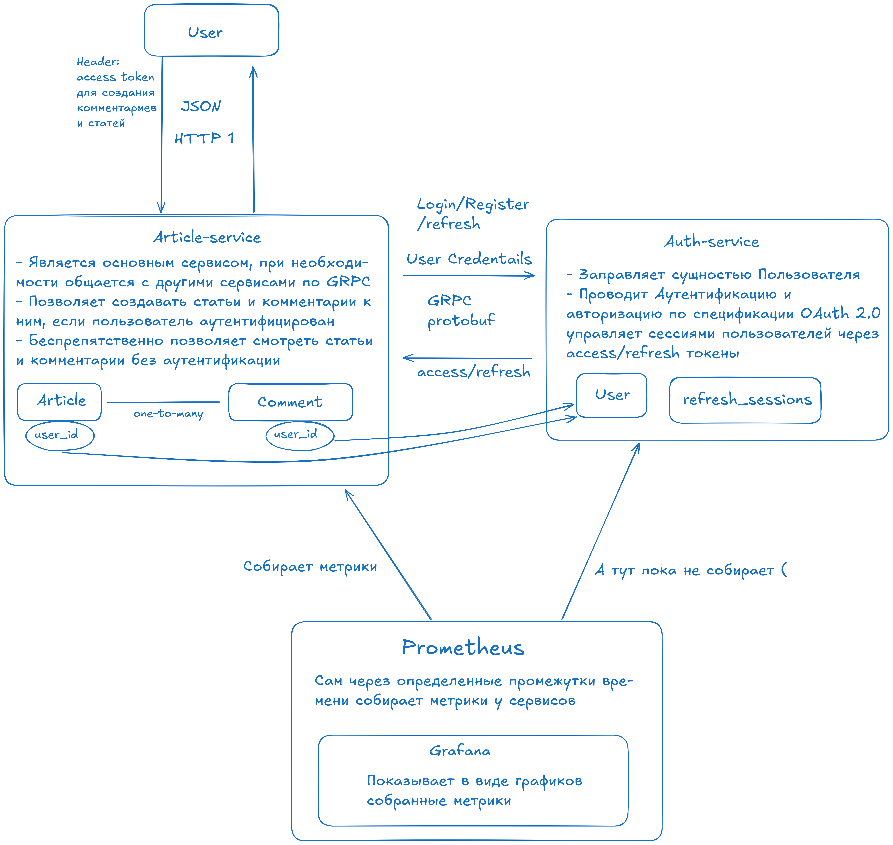

# Articles API

## Навигация

1. [Описание проекта](#описание-проекта)
2. [Основной сервис статей](#основной-сервис-статей)
3. [Сервис аутентификации](#сервис-аутентификации)
4. [Метрики](#метрики)
5. [Используемые технологии](#используемые-технологии)
6. [Запуск](#запуск)

## Описание Проекта



## Основной сервис статей

Является основым сервисом в этой системе, а также прослойкой между клиентом и остальной системой. Если хотите познакомиться с http1 REST API приложения, то смотрите на описание этого сервиса [articles-service](articles-service/readme.md)  
Также данный сервис позволяет создавать статьи и сообщения к ним, но только если вы аутентифицированы. Просматривать уже созданные статьи и комментарии вы можете и без аутентификации.

## Сервис аутентификации

Этот микросервис предназначен для проведения аутентификации и авторизации пользователей, и соответственно оперирует этой сущностью.  
Авторизация в сервисе релизована по спецификации OAuth 2.0, имеются access/refresh токены, реализованы refresh сессии (может быть только одна сессия на пользователя, на каждое устройство). [auth-service](auth-service)

## Метрики

Prometheus. Это сервер, который через определенные промежутки времени собирает метрики со всех сервисов, для проведения аналитики, или, например выявления утечки ресурсов.  
Тут же поднимается Grafana, которая позволяет взглянуть на метрики с помощью графиков. [metrics](collecting-metrics)

## Используемые технологии

- GoLang - как основной язык программирования.
- GRPC, protobuf, http1 REST API - для сетевых взаимодействий.
- PostgreSQL - БД для хранения данных.
- Redis - для кэширования статей и комментариев.
- Swagger - документация API.
- Docker - контейнеризация сервисов.
- Prometheus - для сбора метрик.
- Grafana - для визуализации собранных метрик.

## Запуск

Для начала добавьте сеть в docker, через которую будут общаться сервисы:

```bash
make add-docker-network
```

Затем с помощью команды make запустите все сервисы одной командой:

```bash
make run
```
